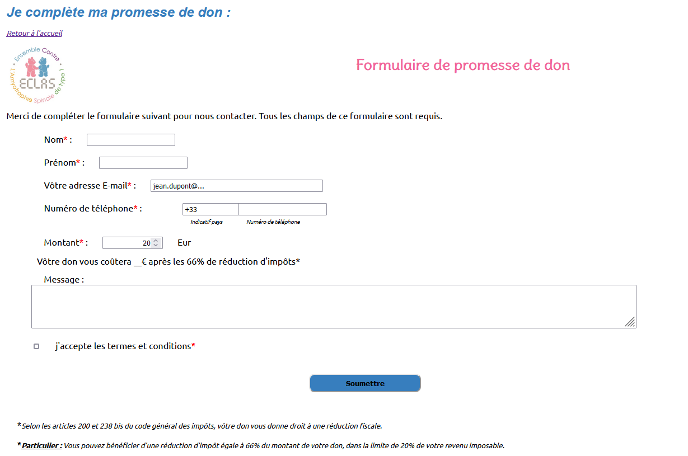
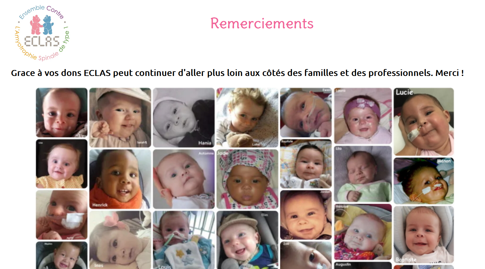

# Une page de promesses de dons (Brief n°2)
Projet ayant pour objectif de créer une page web statique en utilisant HTML/CSS.

## Contexte du projet
Le client est une association caritative qui veut récolter des dons sur le web. Pour ça, il a besoin d'une page qui présente la cause défendue et d'un formulaire de promesse de don. L'objectif est de mettre en place ces 2 pages et de proposer une première maquette du site.

## Modalités 
Créer 2 pages web en utilisant HTML/CSS :
-	1 page d'accueil qui présente l'association et la bonne cause à financer,
- 1 formulaire qui permet de faire une promesse de don (avec saisie du nom, prénom, adresse, mail, somme promise, une coche 'vous avez pris connaissance...', ...).
  
## Maquette
- [Page d'accueil](./templates/index.html) : 
 
- [Page du formulaire de promesse de don](./templates/ajoutdon.html) : 

 
- [Page de remerciement](./templates/add.html) : 

 
