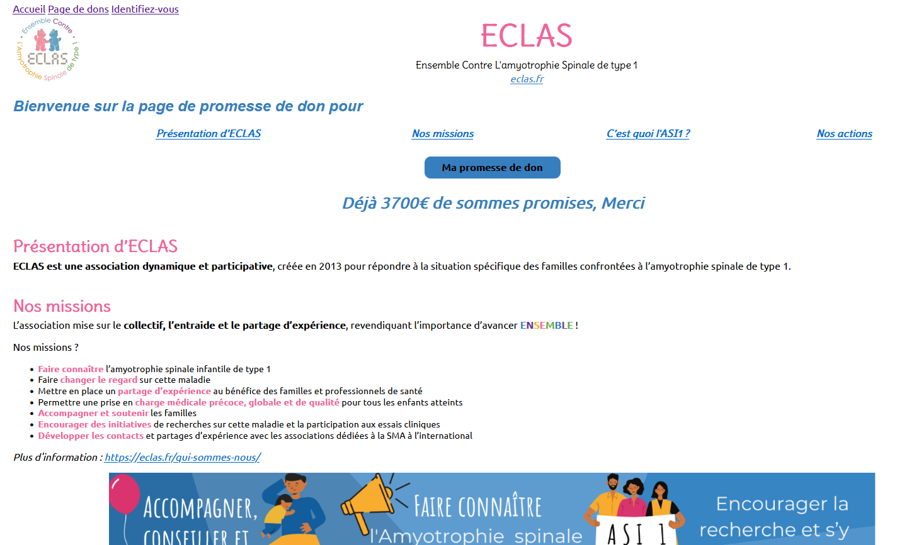
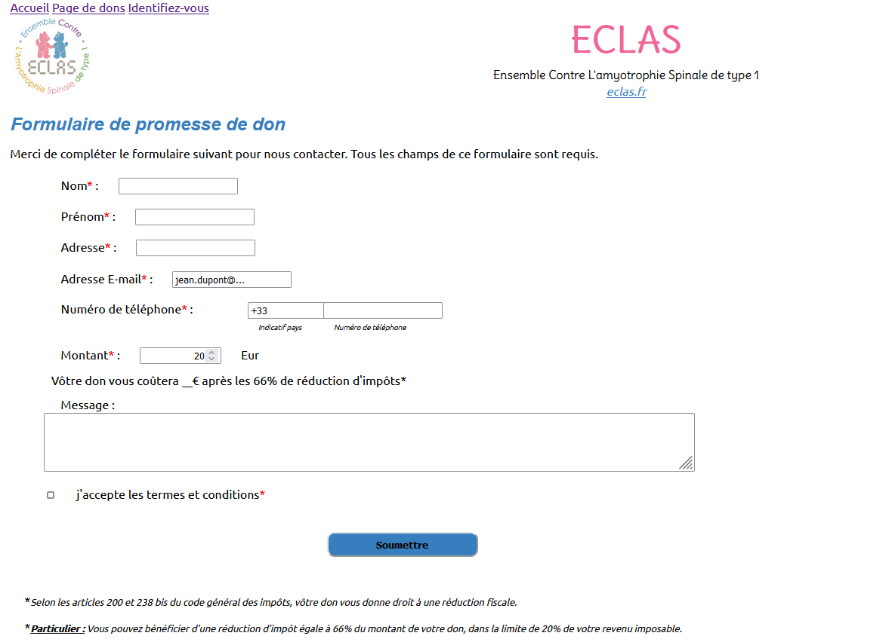
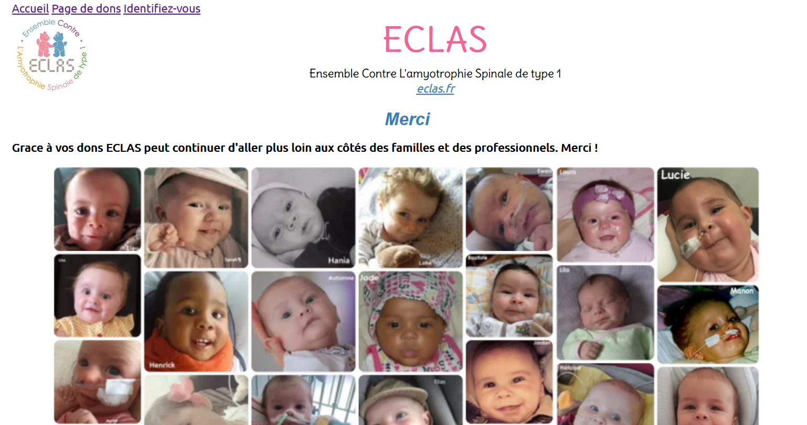
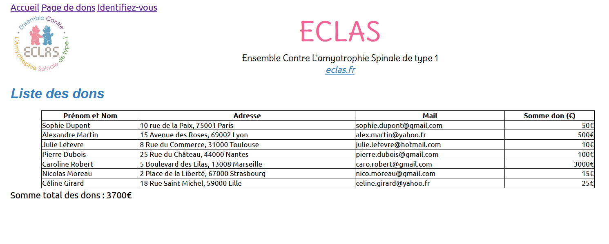
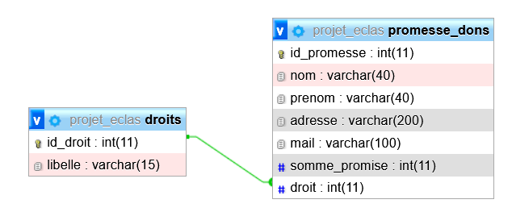
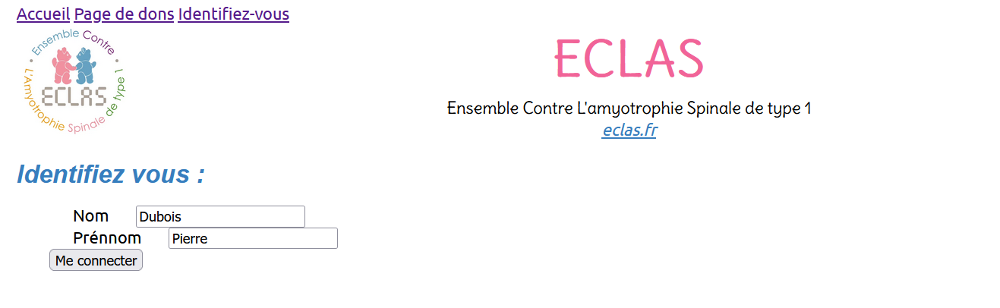
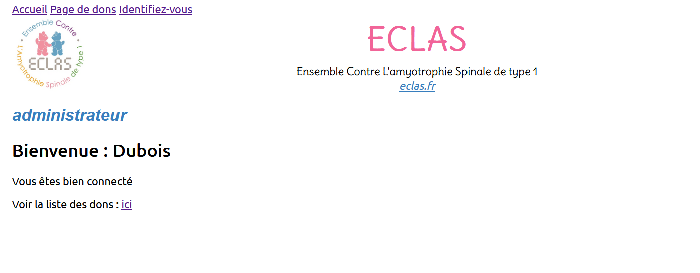

# Pour quelques promesses de dons de plus (Projet n°6)
Evolution du projet "Une-page-de-promesse-de-don" utilisant HTML/CSS, en intégrant le front dans un serveur web développé en Python.


## Contexte du projet
Le client est une association caritative souhaite une évolution de la [Page de promesse de dons](Page_promesses_dons). Elle aimerait que toutes les infos saisies dans les formulaires soient sauvegardées en base de données et qu'elles soient consultables par les responsables de l'association, toujours à partir du site web.

## Maquette 
Création de pages web en utilisant Python, Flask, MySQL, HTML/CSS :
-   1 [page d'accueil](./templates/index.html) qui présente l'association et la bonne cause à financer,
</br>
- 1 [formulaire](./templates/ajoutdon.html) qui permet de faire une promesse de don (avec saisie du nom, prénom, adresse, mail, somme promise, une coche 'vous avez pris connaissance... ', ...).

</br>
- 1 [page de remerciement](./templates/add.html) :</br>

</br>

- 1 [page qui affiche toutes les informations sur les promesses de dons](./templates/listedons.html) (Liste des donateurs, sommes promises, emails à contacter), ainsi que le total récolté.
 :</br>


Les informations du formulaire sont stockées dans une base MySQL. 
</br>


Option supplémentaire : un formulaire de login sur la page récapitulative des dons, qui demande un login/mot de passe. Si la personne est identifiée, en base, comme étant un responsable de l'association, alors, elle accède à la page récapitulative.</br>
- 1 [page d'identification](./templates/identification.html) :</br>

</br>
- 1 [page de connexion administrateur](./templates/identification.html) (accès avec le nom et prénom) : </br>

</br>

## Installation 
- Création d'un environnement :  ```$ pip install -r requirements.txt```
- Exécution avec flask :  ```$ python -m flask run```


