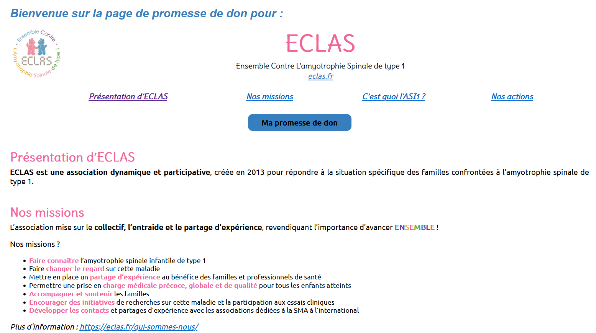
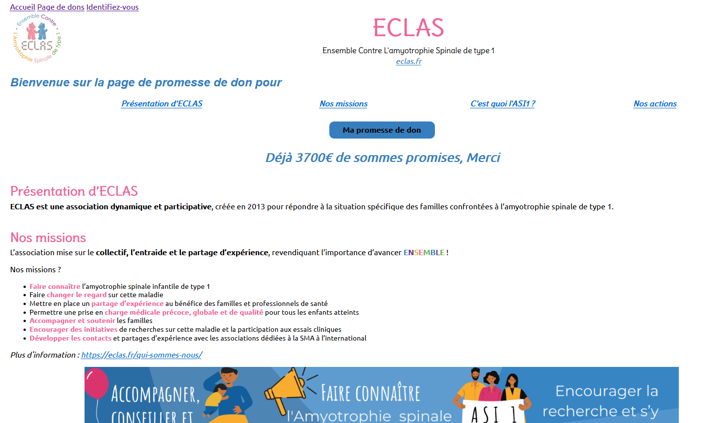

# Htlm/Css/Flask
Sélection de Projets de pages web créées en utilisant HTML/CSS et Flask. 
 

## [Une page de promesses de dons](Page_promesses_dons/README.md) (Brief n°2)
Projet ayant pour objectif de créer une page web statique en utilisant HTML/CSS. 
 
 

## [Pour quelques promesses de dons de plus](Promesses_dons_de_plus/README.md) (Brief n°6)
Evolution du projet "Une page de promesses de dons (Brief n°2)" utilisant HTML/CSS, en intégrant le front dans un serveur web développé en Python (Flask). 
 
 

## [Breizhibus : Gestion des lignes de bus en ligne](https://github.com/MainaLD/Cahier-des-charges-Breizhibus-Brief10.git) (Brief n°10)
Rédaction d'un cahier des charges pour la création du site de Breizhibus permettant la gestion des lignes de bus, en utilisant HTML/CSS et Flask pour le serveur.
 
 
 